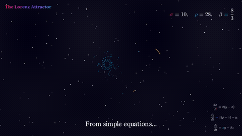
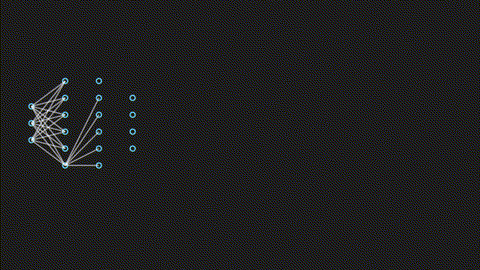
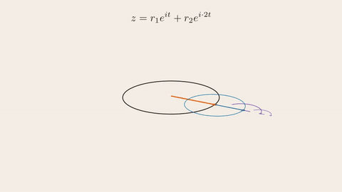
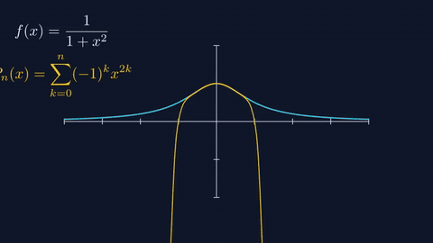
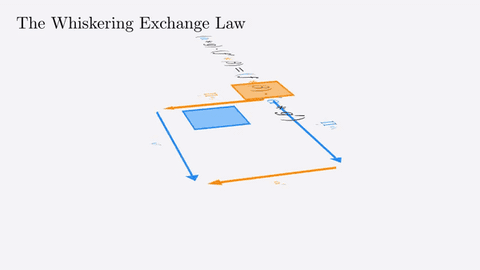
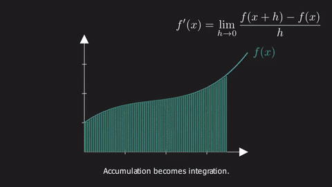

# MathViz 动画画廊

### 教学动画艺术方向参考

[← 返回主页](../../README.md)

 

**好的教学动画，应该让概念自己「浮现」出来。**

---

这些 GIF 多数来自原始 [Math-To-Manim](https://github.com/HarleyCoops/Math-To-Manim) 项目，作为 MathViz 的艺术方向目标和视觉基准：

- 电影级深色数学渲染
- 清晰的解释性图表
- 可读的符号标注和分步揭示
- 几何、拓扑、概率、微积分、物理、机器学习化为动态
- 短循环但能传达核心思想

---

## 精选展示

<table>
<tr>
<td width="33%"></td>
<td width="33%"></td>
<td width="33%"></td>
</tr>
<tr>
<td><b>大斜方截半二十面体</b> 阿基米德立体的生动呈现：蓝色顶点、暖色棱线，3D 对称之美。</td>
<td><b>宇宙引力 3D</b> 时空弯曲如科学纪录片：紫色几何、星辰与场方程的能量。</td>
<td><b>导数即斜率</b> 微积分的顿悟时刻：割线收紧为切线，斜率从符号变为可视。</td>
</tr>
<tr>
<td></td>
<td></td>
<td></td>
</tr>
<tr>
<td><b>洛伦兹吸引子</b> 混沌理论：发光轨迹构成蝴蝶形态，敏感依赖变得有形。</td>
<td><b>霍普夫纤维化</b> 拓扑如编舞：嵌套彩色纤维赋予球极投影空间韵律。</td>
<td><b>ProLIP 场景</b> 科学网络叙事：分子/蛋白质图谱交互可视化。</td>
</tr>
</table>

---

## 教学图解

<table>
<tr>
<td width="25%"></td>
<td width="25%"></td>
<td width="25%"></td>
<td width="25%"></td>
</tr>
<tr>
<td><b>傅里叶本轮</b> 旋转载体追踪结构，傅里叶分析化为编舞。</td>
<td><b>收敛半径</b> 幂级数边界变得可视化，收敛触手可及。</td>
<td><b>导数可视化</b> 坐标轴、曲线、局部线性化，打下切线概念的基础。</td>
<td><b>教学版霍普夫</b> 更温和的教学版纤维化处理，接近幻灯片序列。</td>
</tr>
</table>

---

## 高等数学与机器学习

<table>
<tr>
<td width="33%"></td>
<td width="33%"></td>
<td width="33%"></td>
</tr>
<tr>
<td><b>Whiskering 交换</b> 范畴论结构以形式化视觉证明的节奏呈现。</td>
<td><b>布朗运动与金融</b> 从微积分过渡到测度、概率和样本空间的暗色极简风格。</td>
<td><b>完整 GRPO 语义流形</b> 39 秒完整弧线：兄弟补全变成响应流形上的点，偏好将目标化为运动。</td>
</tr>
</table>

---

## 画廊使用指南

当 MathViz 生成出成功的 MP4 时，将最精彩的片段加入此画廊：
1. 有明确的教学亮点
2. 文字在 README 尺寸下可读
3. 色调稳定，无破损帧
4. 循环足够短，可快速浏览
5. 描述解释概念本身，而不仅仅是文件名

---

## 致谢

动画源自 [HarleyCoops/Math-To-Manim](https://github.com/HarleyCoops/Math-To-Manim)，在 MathViz 中保留作为文档连续性和艺术方向参考。
